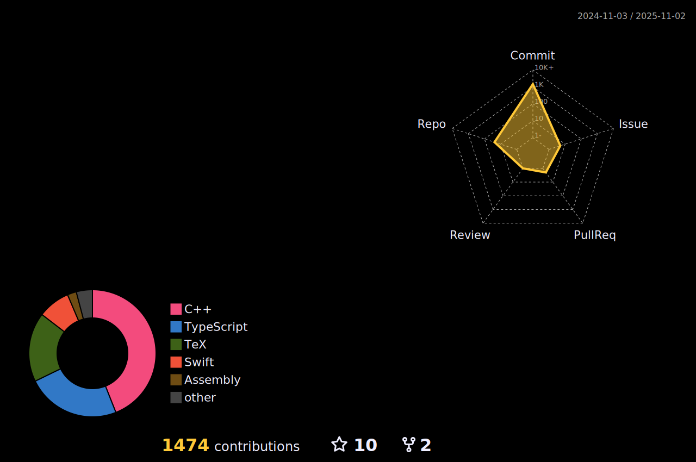

### Hello, My name is Nikachu.
#### Hi there 👋

**🌐Social Links**  
⭐[Portfolio](https://portfolio.nikachu.net/)  
⭐️[Blog](https://blog.nikachu.net)  
⭐️[Twitter](https://twitter.com/nikachu2012)  
⭐️[Instagram](https://instagram.com/nikachu2012/)  
⭐️[GitHub](https://github.com/nikachu2012)  
⭐️[GitLab](https://gitlab.com/nikachu2012)  
⭐️[Qiita](https://qiita.com/nikachu2012)  
⭐️[Zenn](https://zenn.dev/nikachu2012)  

<!--   -->

<!--
**nikachu2012/nikachu2012** is a ✨ _special_ ✨ repository because its `README.md` (this file) appears on your GitHub profile.

Here are some ideas to get you started:

- 🔭 I’m currently working on ...
- 🌱 I’m currently learning ...
- 👯 I’m looking to collaborate on ...
- 🤔 I’m looking for help with ...
- 💬 Ask me about ...
- 📫 How to reach me: ...
- 😄 Pronouns: ...
- ⚡ Fun fact: ...
-->
